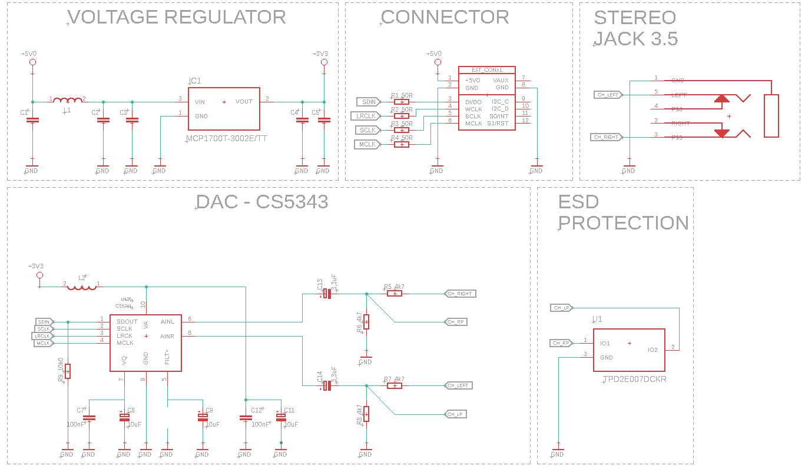
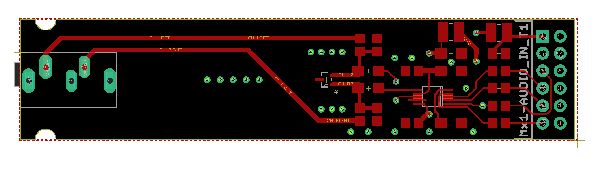
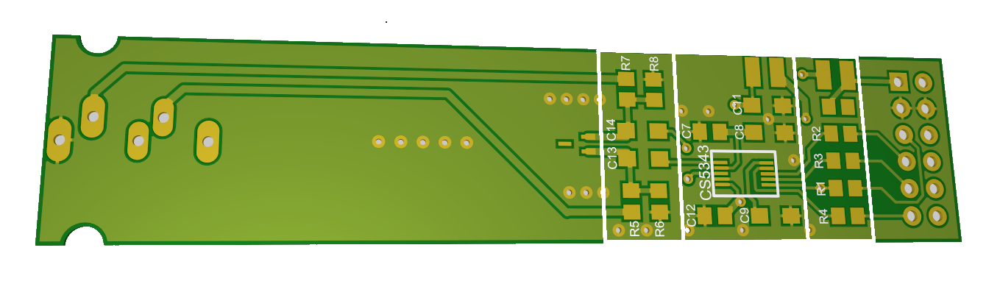

# # Expansion Module: Audio Line In with CS5343

## Overview
This repository hosts the design and implementation of the CS5343 Audio Input Expansion Module. The module integrates the CS5343, a high-performance audio ADC (Analog to Digital Converter), suitable for high-quality audio recording and processing applications. It connects to the mainboard via a standard I2S interface, enabling digital audio capture at high sample rates.

## Key Features of CS5343
- **High-Quality Audio ADC**: Captures pristine audio quality with minimal noise.
- **Supports High Sample Rates**: Up to 192 kHz, allowing for studio-grade audio recording.
- **Low Power Consumption**: Optimized for efficient operation, minimizing power requirements.
- **Digital Output**: I2S interface for straightforward integration with microcontrollers and DSPs.
- **Compact Size**: Small footprint for easy inclusion in various designs.

## Design Documentation

Below are the key design documents for the CS5343 Audio Input Expansion Module, including schematic diagrams and board designs. These documents provide detailed insights into the module's architecture and layout, facilitating understanding and modifications.

### Schematic Diagram

*This is the schematic diagram of the CS5343 Audio Input Expansion Module, showcasing the connection and configuration of the CS5343 ADC and other components.*

### Board Design - 2D

*The 2D board design illustrates the physical layout of the module's components on the PCB, aiding in the assembly and troubleshooting processes.*

### Board Design - 3D Visualization

*This 3D visualization offers a comprehensive view of the module, providing a clearer understanding of its physical characteristics and design considerations.*

## Contributions and Feedback
Contributions to this project are welcome. If you have suggestions for improvement or have developed additional features, please fork the repository, make your changes, and submit a pull request. For any questions or issues, please open an issue in the GitHub repository.

## License
This audio input project is licensed under the MIT License with the following terms:

- **Permission to Use**: You are free to use, modify, and distribute this audio input design in both private and commercial settings.
- **Attribution Requirement**: While not required, attribution to the original author, Adam Łuczak, is appreciated. This can be done through a citation or a link back to this repository.
- **No Warranty**: This design is provided "as is", without warranty of any kind. Use it at your own risk.
- **Liability**: The author is not liable for any damages or losses that may arise from the use of this design.

For the full terms and conditions, please refer to the MIT License documentation.

## Contact
Should you have any inquiries or suggestions regarding this audio input project, please don't hesitate to contact Adam Łuczak at adam.luczak@outlook.com.
